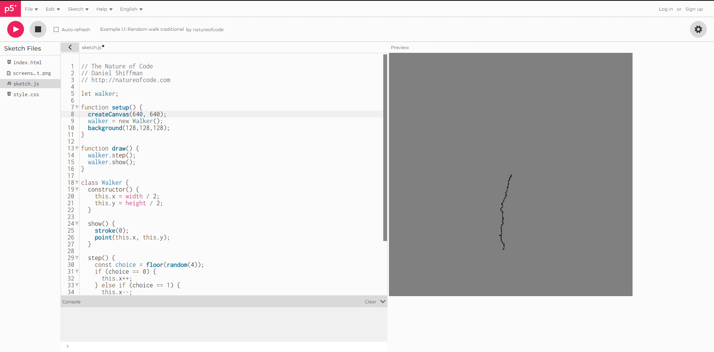

#### Comprendiendo el código de las caminatas aleatorias

Realmente no hice una sóla pregunta, traté de entender bien las partes del código, a qué se refería cada una, y ya de ahí experimenté brevemente pero con varias cosas, es decir, empecé por ver qué pasaría si cambiaba 
el color del rgb del fondo por un gris, obvio también en rgb, porque pues no me sentía cómodo con todo blanco, también agrandé un poco el cuadro ya que tampoco me sentía cómodo con un espacio de trabajo por la otra 
pregunta que tenía y era que si en lugar de dejar la opción de ir hacia arriba, la quitaba, y luego ponía nuevamente la de ir hacia abajo, al haber el doble de probabilidades la raya por así decirlo se dibujaría
el doble de rápido hacia abajo, era lógica pura, y así fue.

En resumen, mis preguntas fueron ¿Qué pasaría si hago más grande este número el cual parece ser el tamaño del cuadro del canvas? ¿Qué pasaría si cambio este rgb por algo un poco más cómodo de ver? 
¿Qué pasaría si quito la opción de ir hacia arriba y en su lugar pongo otra de ir hacia abajo?

Claramente las dos primeras eran bastante obvias, el cuadro se iba a agrandar y a hacer gris ya que de ese color había puesto el rgb, y la otra mi hipótesis fue correcta, que se movería hacia abajo el doble de rápido
debido a que tenía el doble de posibilidad, en este caso primero quité la opción de ir hacia arriba, sin reemplazar, luego efectivamente puse dos veces la opción de ir hacia abajo y así fue, empezó a moverse hacia abajo
más rápidamente c:

##### - Ahora, las preguntas que quería responder con este experimento:

- ¿Entiendo correctamente la naturaleza del código? ¿Entiendo correctamente qué hace cada parte por sencillo que sea? ¿No estoy confundiendo conceptos básicos de lo que se me acaba de explicar en la lectura?
- Esperaba que el cuadro se ampliara, se pusiera gris y la línea nunca subiera, sino que bajara y de hecho bajara el doble de rápido
- Los obtuve todos jaja
- Aprendí que realmente es un código bastante simple y predecible de modificar, quizá fue por lo que escogí

##### - Ahora, la imagen del código funcionando:



##### - Ahora, el código modificado:
``` js

let walker;

function setup() {
  createCanvas(640, 640);      //Esta fue la modificación de tamaño
  walker = new Walker();
  background(128,128,128);      //Esta fue la modificación de color
}

function draw() {
  walker.step();
  walker.show();
}

class Walker {
  constructor() {
    this.x = width / 2;
    this.y = height / 2;
  }

  show() {
    stroke(0);
    point(this.x, this.y);
  }

  step() {
    const choice = floor(random(4));
    if (choice == 0) {
      this.x++;
    } else if (choice == 1) {
      this.x--;
    } else if (choice == 2) {
      this.y++;
    } else {      //Aquí fue donde puse la otra opción hacia abajo
      this.y++;
    //} else {//      //Y aquí quedó en comentarios la anterior, la que iba hacia arriba
    //  this.y--;//
    }
  }
}
```

