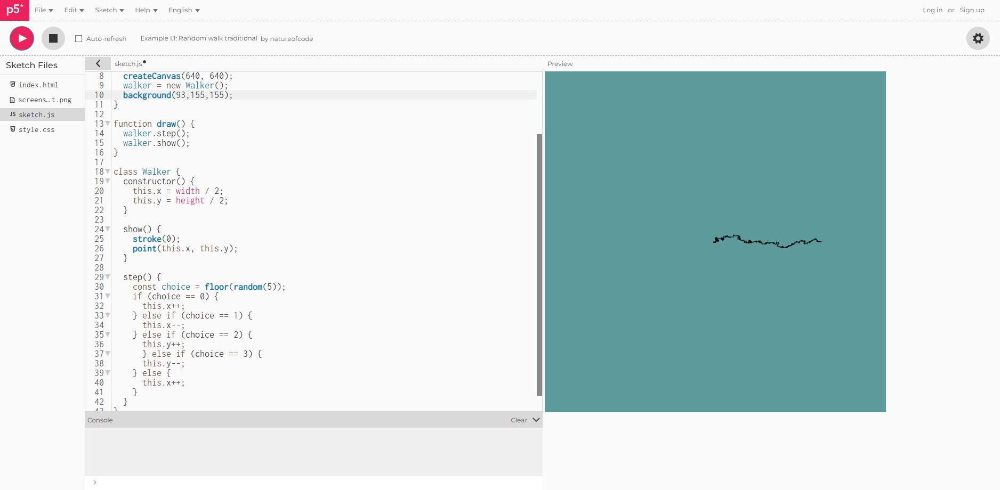

#### Distribución no uniforme hacia la derechaaa

Realmente me parece que la diferencia es bastante sencilla, una distribución uniforme es aquella en la cual todos los números tienen exactamente las mismas probabilidades de salir, es decir, si tenemos 4 números, 
el 1, el 2, el 3 y el 4, todos tienen 25% de probabilidades de salir, sin embargo, una distribución no uniforme, es aquella en la que algunos números tienen más probabilidad de salir que otros, creando en este caso
una campana de gauss, por ejemplo, en este caso, con estos mismos números, digamos que el 3 y el 4 tienen un 30% de posibilidades de salir, mientras que el 1 y el 2 sólo tinene un 20%, es un hecho de que es
más probable que el 3 y el 4 salgan.

En resumen, en una distribución uniforme todos los números tienen la misma posibilidad de salir, y en una distribución no uniforme hay números con más posibilidades de salir que otros.

En el caso de las caminatas aleatorias lo único que hizo falta para que esta fuera una distribución no uniforme fue algo similar a lo que hice con la anterior actividad, que fue básicamente añadir 
otra posibilidad de que fuera hacia la derecha, haciendo que de esta manera, por mucho que en ocasiones fuera hacia la izquierda, debido a que había el doble de probabilidades de ir hacia la derecha, la caminata en 
este caso, siempre iba a tender a ir hacia la derechaaa.


##### - Ahora, la imagen del código funcionando:



##### - Ahora, el código modificado:
```javascript
// The Nature of Code
// Daniel Shiffman
// http://natureofcode.com

let walker;

function setup() {
  createCanvas(640, 640);      //Obviamente lo agrandé 
  walker = new Walker();
  background(93,155,155);      //Esta vez lo puse azul
}

function draw() {
  walker.step();
  walker.show();
}

class Walker {
  constructor() {
    this.x = width / 2;
    this.y = height / 2;
  }

  show() {
    stroke(0);
    point(this.x, this.y);
  }

  step() {
    const choice = floor(random(5));      //Aquí aumenté el número de aleatoreidades
    if (choice == 0) {
      this.x++;
    } else if (choice == 1) {
      this.x--;
    } else if (choice == 2) {
      this.y++;
      } else if (choice == 3) {
      this.y--;
    } else {      //Y aquí puse otra posibilidad de que pueda ir a la derecha, de esa manera aunque a veces se devuelve, tiende a ir más hacia allá
      this.x++;
    }
  }
}
```
