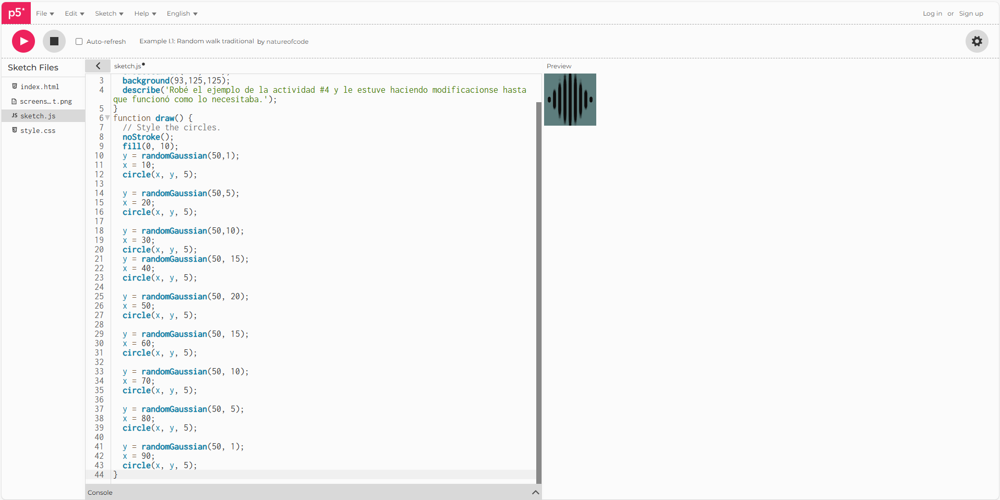

Lo que hice fue ponerme a jugar un poco con el código de explicación de la distribución normal de la actividad #4, y tuve un resultado bastante cómodo a mi parecer, pues se nota como directamente se forma una campana de gauss en la visualización del código, la cual es la siguiente:



Me parece que es más que evidente que la distribución normal se refleja de manera directa en la campana que se forma al momento de verse la visualización del código, el cual es el siguiente:


```js
function setup() {
  createCanvas(100, 100);
  background(93,125,125);
  describe('Robé el ejemplo de la actividad #4 y le estuve haciendo modificaciones hasta que funcionó como lo necesitaba.');
}
function draw() {
  // Style the circles.
  noStroke();
  fill(0, 10);
  y = randomGaussian(50,1);
  x = 10;
  circle(x, y, 5);
  
  y = randomGaussian(50,5);
  x = 20;
  circle(x, y, 5);
  
  y = randomGaussian(50,10);
  x = 30;
  circle(x, y, 5);
  y = randomGaussian(50, 15);
  x = 40;
  circle(x, y, 5);
  
  y = randomGaussian(50, 20);
  x = 50;
  circle(x, y, 5);
  
  y = randomGaussian(50, 15);
  x = 60;
  circle(x, y, 5);
  
  y = randomGaussian(50, 10);
  x = 70;
  circle(x, y, 5);
  
  y = randomGaussian(50, 5);
  x = 80;
  circle(x, y, 5);
  
  y = randomGaussian(50, 1);
  x = 90;
  circle(x, y, 5);
}
```
