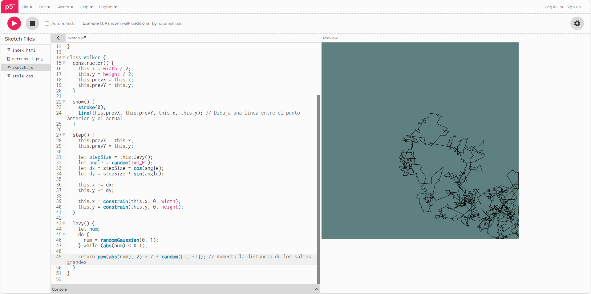

#### Vuelo de Lévy 

En este caso, el vuelo de lévy es un tipo de caminata aleatoria en que la mayoría de pasos son pequeños, pero de vez en cuando ocurre un salto considerablemente largo, y es en esencia esto lo que la diferencia de una caminata aleatoria normal, donde todos los pasos tienen prácticamente la misma distancia o el mismo tamaño por así decirlo, y si se llega a notar alguna inclinación es por mera aleatoreidad.

Este concepto normalmente se usa para modelar o simular movimientos naturales, estos pueden ser el patrón de búsqueda de comida de los animales, cuando claramente se dan cuenta que en la zona ya no hay y van hacia otra zona a seguir buscando, o en un caso un poco más experimental, en el comportamiento de partículas como pueden ser las de fluidos turbulentos, algo también aleatorio y muy variable.



```js
let walker;

function setup() {
  createCanvas(640, 640);
  walker = new Walker();
  background(95, 128, 128);
}

function draw() {
  walker.step();
  walker.show();
}

class Walker {
  constructor() {
    this.x = width / 2;
    this.y = height / 2;
    this.prevX = this.x;
    this.prevY = this.y;
  }

  show() {
    stroke(0);
    line(this.prevX, this.prevY, this.x, this.y); // Dibuja una línea entre el punto anterior y el actual
  }

  step() {
    this.prevX = this.x;
    this.prevY = this.y;

    let stepSize = this.levy();
    let angle = random(TWO_PI);
    let dx = stepSize * cos(angle);
    let dy = stepSize * sin(angle);

    this.x += dx;
    this.y += dy;

    this.x = constrain(this.x, 0, width);
    this.y = constrain(this.y, 0, height);
  }

  levy() {
    let num;
    do {
      num = randomGaussian(0, 1);
    } while (abs(num) < 0.1); 

    return pow(abs(num), 2) * 7 * random([1, -1]); // Aumenta la distancia de los saltos grandes
  }
}
```
